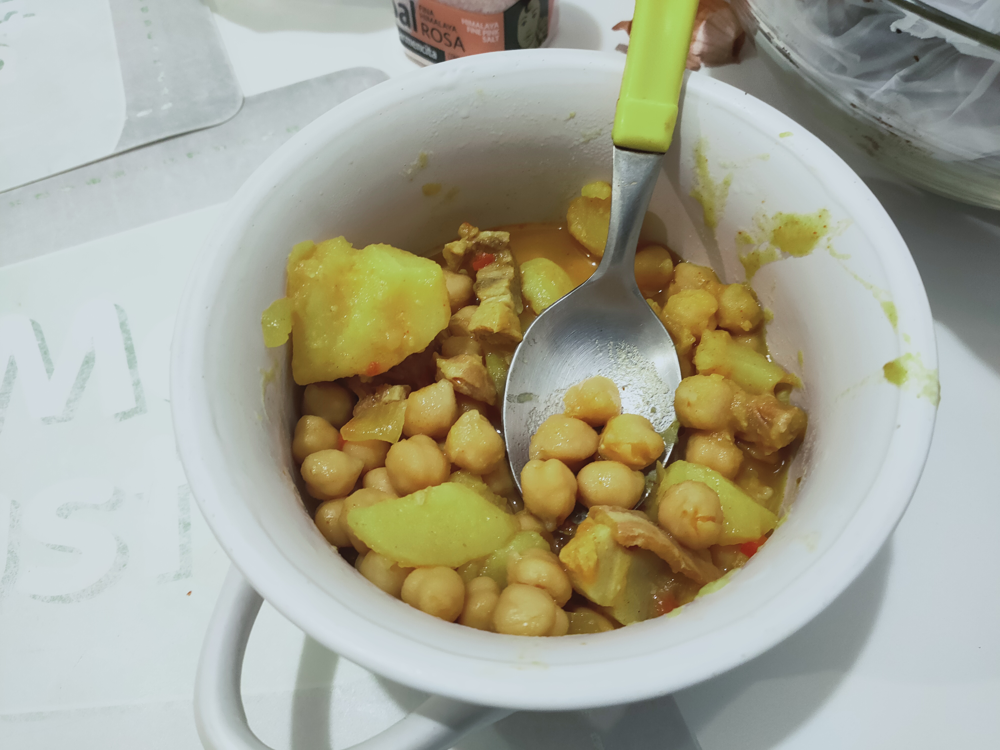

## Bienvenido a Coooking Soul

Cooking soul es mi primer proyecto de escribir un blog sobre temas de cocina.


### Mis recetas

### Garbanzos a la Susana

Mis garbanzos quedan asi:Garbanzos compuestos de pedrosilla.





### Tortilla de papas


**Ingredientes**

* Huevos
* papas
* Aceit
* Sal

**Procedimiento**

1. Se cortan las papas en rodajas finas
2. blah


Markdown is a lightweight and easy-to-use syntax for styling your writing. It includes conventions for

```markdown
Syntax highlighted code block

# Header 1
## Header 2
### Header 3

- Bulleted
- List

1. Numbered
2. List

**Bold** and _Italic_ and `Code` text

[Link](url) and 
```

For more details see [GitHub Flavored Markdown](https://guides.github.com/features/mastering-markdown/).

### Acerca de. mi

Your Pages site will use the layout and styles from the Jekyll theme you have selected in your [repository settings](https://github.com/cooking-lifeboold/cooking-lifeboold.github.io/settings/pages). The name of this theme is saved in the Jekyll `_config.yml` configuration file.

### Contacto

Having trouble with Pages? Check out our [documentation](https://docs.github.com/categories/github-pages-basics/) or [contact support](https://support.github.com/contact) and we’ll help you sort it out.
